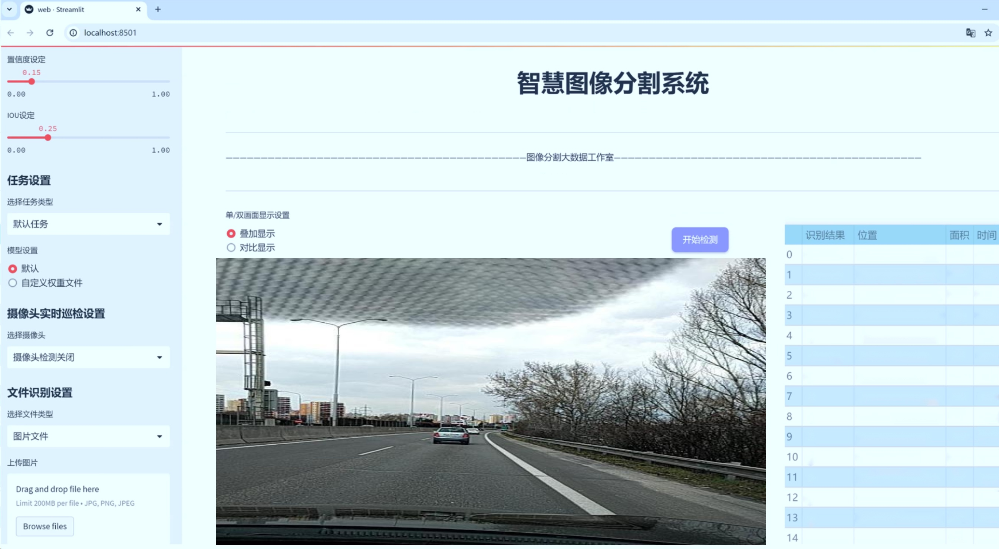
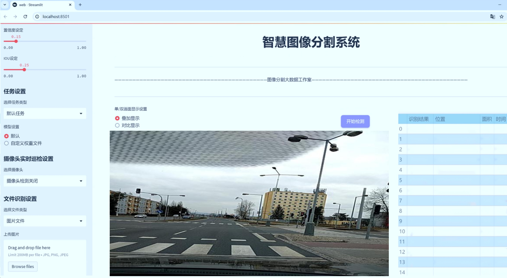
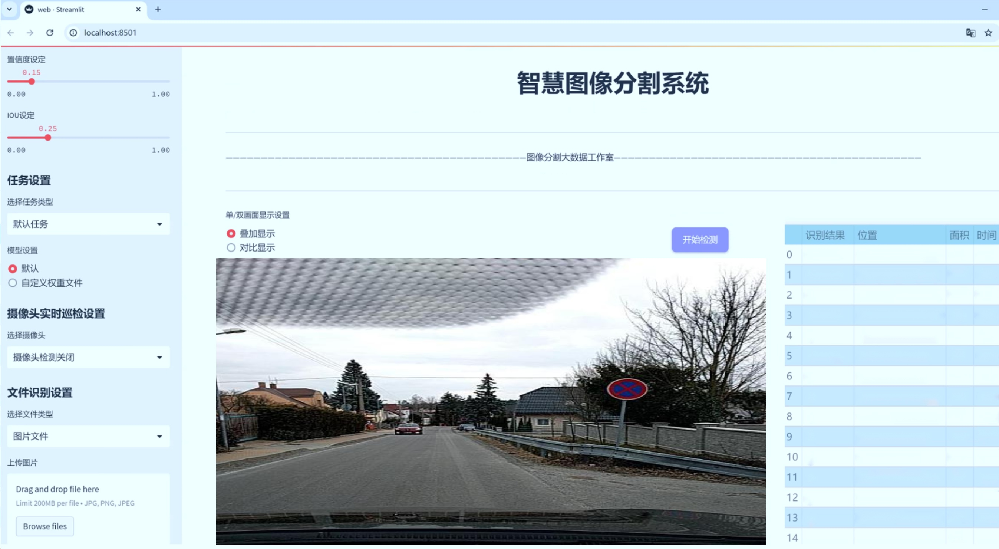
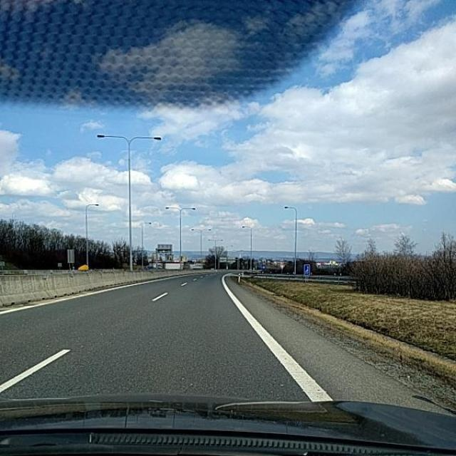
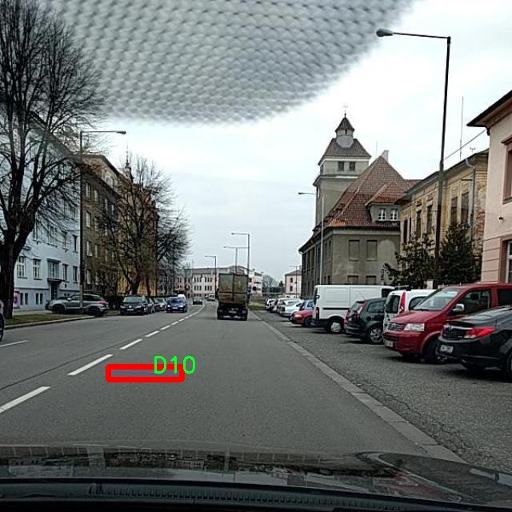
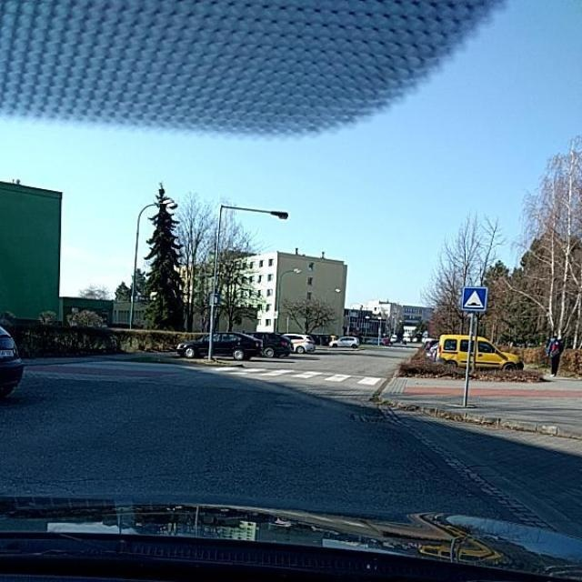
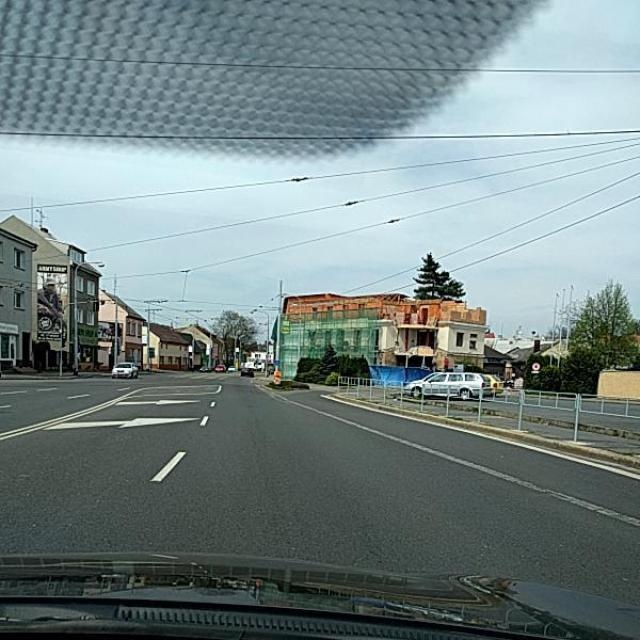
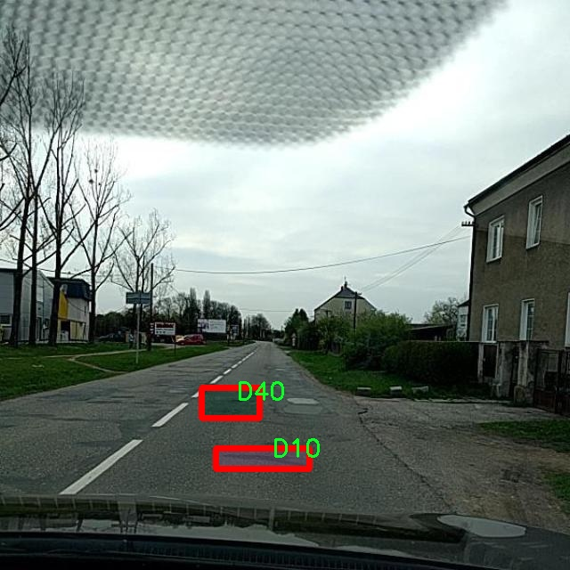

# 道路坑洞图像分割系统源码＆数据集分享
 [yolov8-seg-C2f-DySnakeConv＆yolov8-seg等50+全套改进创新点发刊_一键训练教程_Web前端展示]

### 1.研究背景与意义

项目参考[ILSVRC ImageNet Large Scale Visual Recognition Challenge](https://gitee.com/YOLOv8_YOLOv11_Segmentation_Studio/projects)

项目来源[AAAI Global Al lnnovation Contest](https://kdocs.cn/l/cszuIiCKVNis)

研究背景与意义

随着城市化进程的加快，交通基础设施的建设与维护显得尤为重要。在城市道路中，坑洞不仅影响行车安全，还可能导致交通事故，增加维修成本。因此，及时、准确地检测和修复道路坑洞是城市管理者亟需解决的问题。传统的道路坑洞检测方法多依赖人工巡查或简单的图像处理技术，这些方法不仅效率低下，而且容易受到环境因素的影响，导致漏检或误检现象频繁发生。为了解决这一问题，基于深度学习的图像分割技术逐渐成为研究的热点，其中YOLO（You Only Look Once）系列模型因其高效的实时检测能力而受到广泛关注。

YOLOv8作为YOLO系列的最新版本，具有更高的准确性和更快的处理速度，适合于实时应用场景。然而，尽管YOLOv8在目标检测领域表现出色，但在复杂背景下的图像分割任务中仍然存在一定的局限性。因此，针对道路坑洞的特征，改进YOLOv8以提高其在图像分割任务中的表现，具有重要的理论与实践意义。

本研究基于改进YOLOv8的道路坑洞图像分割系统，利用“yolo-set-01”数据集进行训练与验证。该数据集包含3000张图像，涵盖了6个类别，包括不同类型的道路坑洞（D00、D10、D20、D40）及其他相关类别。通过对这些图像的深入分析，可以有效提取道路坑洞的特征信息，为后续的图像分割提供丰富的数据支持。数据集的多样性和丰富性使得模型在训练过程中能够学习到不同场景下的坑洞特征，从而提高模型的泛化能力。

在技术层面，改进YOLOv8的图像分割系统将结合先进的深度学习算法，采用多尺度特征融合、注意力机制等技术，旨在提升模型对道路坑洞的识别精度与分割效果。通过引入实例分割的思想，不仅可以实现对坑洞的精确定位，还能够对不同类型的坑洞进行分类，从而为后续的维护工作提供数据支持。

从社会意义上看，基于改进YOLOv8的道路坑洞图像分割系统将为城市管理者提供一种高效、准确的道路坑洞检测手段，降低人工巡查的成本，提高道路维护的效率。同时，该系统的应用将有助于提升城市交通安全，减少因道路坑洞引发的交通事故，保障市民的出行安全。此外，随着智能交通系统的发展，该技术的推广应用将为未来的智能城市建设提供重要的技术支撑。

综上所述，基于改进YOLOv8的道路坑洞图像分割系统的研究，不仅具有重要的学术价值，也具备显著的应用前景。通过深入探索和优化该系统，期望能够为道路坑洞的智能检测与管理提供新的解决方案，推动城市交通基础设施的智能化进程。

### 2.图片演示







##### 注意：由于此博客编辑较早，上面“2.图片演示”和“3.视频演示”展示的系统图片或者视频可能为老版本，新版本在老版本的基础上升级如下：（实际效果以升级的新版本为准）

  （1）适配了YOLOV8的“目标检测”模型和“实例分割”模型，通过加载相应的权重（.pt）文件即可自适应加载模型。

  （2）支持“图片识别”、“视频识别”、“摄像头实时识别”三种识别模式。

  （3）支持“图片识别”、“视频识别”、“摄像头实时识别”三种识别结果保存导出，解决手动导出（容易卡顿出现爆内存）存在的问题，识别完自动保存结果并导出到tempDir中。

  （4）支持Web前端系统中的标题、背景图等自定义修改，后面提供修改教程。

  另外本项目提供训练的数据集和训练教程,暂不提供权重文件（best.pt）,需要您按照教程进行训练后实现图片演示和Web前端界面演示的效果。

### 3.视频演示

[3.1 视频演示](https://www.bilibili.com/video/BV1gF2wYyE8K/)

### 4.数据集信息展示

##### 4.1 本项目数据集详细数据（类别数＆类别名）

nc: 5
names: ['0', 'D00', 'D10', 'D20', 'D40']


##### 4.2 本项目数据集信息介绍

数据集信息展示

在本研究中，我们采用了名为“yolo-set-01”的数据集，以支持改进YOLOv8-seg的道路坑洞图像分割系统的训练和评估。该数据集专门针对道路坑洞的检测与分割任务而设计，旨在提升计算机视觉模型在实际应用中的准确性和鲁棒性。数据集的构建过程经过精心策划，确保其在多样性和代表性方面能够满足模型训练的需求。

“yolo-set-01”数据集包含五个类别，分别为“0”、“D00”、“D10”、“D20”和“D40”。这些类别的设计旨在涵盖不同类型和严重程度的道路坑洞，提供丰富的样本以便于模型学习。类别“0”代表未标记或背景区域，而其他类别则分别对应不同深度和宽度的坑洞，具体如下：D00表示轻微的坑洞，D10表示中等程度的坑洞，D20表示较严重的坑洞，D40则代表极为严重的坑洞。这种细致的分类方式使得模型能够在处理实际场景时，针对不同类型的坑洞做出更加精准的判断和分割。

数据集的图像来源于多种道路环境，涵盖城市街道、乡村公路及高速公路等多种场景，确保了数据的多样性与广泛性。每张图像均经过严格的标注，确保坑洞的边界清晰可辨，标注过程采用了专业的图像标注工具，确保了标注的准确性和一致性。这些图像不仅包含不同光照条件下的坑洞，还包括不同天气情况下的道路状况，从而增强了模型在各种环境下的适应能力。

在数据集的构建过程中，考虑到了数据的平衡性和多样性，确保每个类别的样本数量相对均衡，避免了模型在训练过程中出现偏向某一类别的现象。通过这种方式，模型能够更全面地学习到各类坑洞的特征，从而在实际应用中提高检测的准确率和召回率。

此外，为了进一步增强模型的泛化能力，数据集还包含了一些经过数据增强处理的图像。这些增强手段包括随机裁剪、旋转、亮度调整等，旨在模拟真实世界中可能遇到的各种情况，使得模型在面对未知数据时，能够保持较高的性能。

在训练过程中，我们将“yolo-set-01”数据集分为训练集、验证集和测试集，以便于对模型的性能进行全面评估。训练集用于模型的学习，验证集用于调参和模型选择，而测试集则用于最终的性能评估。通过这种科学的划分方式，我们能够确保模型在训练过程中不会过拟合，并能够在未见过的数据上进行有效的推断。

综上所述，“yolo-set-01”数据集为改进YOLOv8-seg的道路坑洞图像分割系统提供了坚实的基础。通过精心设计的类别划分和丰富的样本来源，该数据集不仅提升了模型的训练效果，也为未来在道路维护和管理中的实际应用奠定了良好的基础。











### 5.全套项目环境部署视频教程（零基础手把手教学）

[5.1 环境部署教程链接（零基础手把手教学）](https://www.bilibili.com/video/BV1jG4Ve4E9t/?vd_source=bc9aec86d164b67a7004b996143742dc)


[5.2 安装Python虚拟环境创建和依赖库安装视频教程链接（零基础手把手教学）](https://www.bilibili.com/video/BV1nA4VeYEze/?vd_source=bc9aec86d164b67a7004b996143742dc)

### 6.手把手YOLOV8-seg训练视频教程（零基础小白有手就能学会）

[6.1 手把手YOLOV8-seg训练视频教程（零基础小白有手就能学会）](https://www.bilibili.com/video/BV1cA4VeYETe/?vd_source=bc9aec86d164b67a7004b996143742dc)


按照上面的训练视频教程链接加载项目提供的数据集，运行train.py即可开始训练



     Epoch   gpu_mem       box       obj       cls    labels  img_size
     1/200     0G   0.01576   0.01955  0.007536        22      1280: 100%|██████████| 849/849 [14:42<00:00,  1.04s/it]
               Class     Images     Labels          P          R     mAP@.5 mAP@.5:.95: 100%|██████████| 213/213 [01:14<00:00,  2.87it/s]
                 all       3395      17314      0.994      0.957      0.0957      0.0843

     Epoch   gpu_mem       box       obj       cls    labels  img_size
     2/200     0G   0.01578   0.01923  0.007006        22      1280: 100%|██████████| 849/849 [14:44<00:00,  1.04s/it]
               Class     Images     Labels          P          R     mAP@.5 mAP@.5:.95: 100%|██████████| 213/213 [01:12<00:00,  2.95it/s]
                 all       3395      17314      0.996      0.956      0.0957      0.0845

     Epoch   gpu_mem       box       obj       cls    labels  img_size
     3/200     0G   0.01561    0.0191  0.006895        27      1280: 100%|██████████| 849/849 [10:56<00:00,  1.29it/s]
               Class     Images     Labels          P          R     mAP@.5 mAP@.5:.95: 100%|███████   | 187/213 [00:52<00:00,  4.04it/s]
                 all       3395      17314      0.996      0.957      0.0957      0.0845


### 7.50+种全套YOLOV8-seg创新点代码加载调参视频教程（一键加载写好的改进模型的配置文件）

[7.1 50+种全套YOLOV8-seg创新点代码加载调参视频教程（一键加载写好的改进模型的配置文件）](https://www.bilibili.com/video/BV1Hw4VePEXv/?vd_source=bc9aec86d164b67a7004b996143742dc)

### 8.YOLOV8-seg图像分割算法原理

原始YOLOv8-seg算法原理

YOLOv8-seg算法是目标检测与图像分割领域中的一项重要进展，代表了YOLO系列算法的最新成果。该算法在YOLOv5的基础上进行了多项创新与优化，尤其是在网络结构、损失函数以及特征提取等方面的改进，使其在准确性和效率上都得到了显著提升。YOLOv8-seg不仅能够进行目标检测，还能够对目标进行精确的像素级分割，这使得它在实际应用中具有更广泛的适用性。

首先，YOLOv8-seg的网络结构由三部分组成：Backbone、Neck和Head。Backbone负责特征提取，Neck负责特征融合，而Head则负责最终的检测与分割结果输出。YOLOv8在Backbone部分采用了CSP（Cross Stage Partial）结构，结合了C2F（Crossover Feature）模块的设计理念。这一模块通过并行化的梯度流分支，能够在保证网络轻量化的同时，获取更加丰富的特征信息，从而提升了模型的精度和推理速度。

在Neck部分，YOLOv8-seg进一步优化了特征融合的过程，去除了YOLOv5中多余的上采样卷积层，直接对不同阶段输出的特征进行上采样。这种简化的设计不仅提高了特征融合的效率，还减少了计算复杂度，使得模型在处理高分辨率图像时表现得更加出色。

YOLOv8-seg的Head部分则是其创新的核心所在。与以往的Coupled-Head结构不同，YOLOv8-seg采用了Decoupled-Head结构，将目标检测与分割任务解耦。具体而言，Head部分通过两个1x1卷积模块对输入特征图进行降维处理，分别生成类别预测和边界框回归的输出。这种解耦设计使得模型能够更专注于每个任务的特定需求，从而提高了整体的检测与分割性能。

在损失函数的设计上，YOLOv8-seg引入了变焦损失（Focal Loss）和数据平均保真度损失（Average Fidelity Loss），使得模型在训练过程中能够更好地处理类别不平衡问题。通过这种新的损失策略，YOLOv8-seg能够更准确地进行目标检测和分割，尤其是在面对复杂场景和多样化目标时，表现得尤为突出。

值得一提的是，YOLOv8-seg还采用了Anchor-Free的方法，摒弃了传统的Anchor-Based策略。这一创新使得模型在处理不同尺度和长宽比的目标时更加灵活，减少了预设Anchor的计算负担，提高了模型的泛化能力。通过将目标检测转化为关键点检测，YOLOv8-seg能够更高效地识别目标，并进行精确的像素级分割。

在输入处理方面，YOLOv8-seg采用了自适应图像缩放技术，以提高目标检测和推理的速度。该算法在训练过程中还使用了Mosaic图像增强技术，通过随机拼接多张图像，迫使模型学习不同位置和周围像素的特征，从而提升了模型的鲁棒性和准确性。

总的来说，YOLOv8-seg算法通过对网络结构的优化、损失函数的创新以及输入处理的改进，成功地实现了高效且准确的目标检测与图像分割。其在各类应用场景中的表现都显示出其优越性，成为当前目标检测与分割领域中的一项重要工具。随着技术的不断进步，YOLOv8-seg无疑将在未来的研究与应用中发挥更大的作用。


### 9.系统功能展示（检测对象为举例，实际内容以本项目数据集为准）

图9.1.系统支持检测结果表格显示

  图9.2.系统支持置信度和IOU阈值手动调节

  图9.3.系统支持自定义加载权重文件best.pt(需要你通过步骤5中训练获得)

  图9.4.系统支持摄像头实时识别

  图9.5.系统支持图片识别

  图9.6.系统支持视频识别

  图9.7.系统支持识别结果文件自动保存

  图9.8.系统支持Excel导出检测结果数据


### 10.50+种全套YOLOV8-seg创新点原理讲解（非科班也可以轻松写刊发刊，V11版本正在科研待更新）

#### 10.1 由于篇幅限制，每个创新点的具体原理讲解就不一一展开，具体见下列网址中的创新点对应子项目的技术原理博客网址【Blog】：


[10.1 50+种全套YOLOV8-seg创新点原理讲解链接](https://gitee.com/qunmasj/good)

#### 10.2 部分改进模块原理讲解(完整的改进原理见上图和技术博客链接)【此小节的图要是加载失败请移步原始博客查看，链接：https://blog.csdn.net/cheng2333333?type=blog】
### YOLOv8简介
#### Backbone


借鉴了其他算法的这些设计思想

借鉴了VGG的思想，使用了较多的3×3卷积，在每一次池化操作后，将通道数翻倍；

借鉴了network in network的思想，使用全局平均池化（global average pooling）做预测，并把1×1的卷积核置于3×3的卷积核之间，用来压缩特征；（我没找到这一步体现在哪里）

使用了批归一化层稳定模型训练，加速收敛，并且起到正则化作用。

    以上三点为Darknet19借鉴其他模型的点。Darknet53当然是在继承了Darknet19的这些优点的基础上再新增了下面这些优点的。因此列在了这里

借鉴了ResNet的思想，在网络中大量使用了残差连接，因此网络结构可以设计的很深，并且缓解了训练中梯度消失的问题，使得模型更容易收敛。

使用步长为2的卷积层代替池化层实现降采样。（这一点在经典的Darknet-53上是很明显的，output的长和宽从256降到128，再降低到64，一路降低到8，应该是通过步长为2的卷积层实现的；在YOLOv8的卷积层中也有体现，比如图中我标出的这些位置）

#### 特征融合

模型架构图如下

  Darknet-53的特点可以这样概括：（Conv卷积模块+Residual Block残差块）串行叠加4次

  Conv卷积层+Residual Block残差网络就被称为一个stage


上面红色指出的那个，原始的Darknet-53里面有一层 卷积，在YOLOv8里面，把一层卷积移除了

为什么移除呢？

        原始Darknet-53模型中间加的这个卷积层做了什么？滤波器（卷积核）的个数从 上一个卷积层的512个，先增加到1024个卷积核，然后下一层卷积的卷积核的个数又降低到512个

        移除掉这一层以后，少了1024个卷积核，就可以少做1024次卷积运算，同时也少了1024个3×3的卷积核的参数，也就是少了9×1024个参数需要拟合。这样可以大大减少了模型的参数，（相当于做了轻量化吧）

        移除掉这个卷积层，可能是因为作者发现移除掉这个卷积层以后，模型的score有所提升，所以才移除掉的。为什么移除掉以后，分数有所提高呢？可能是因为多了这些参数就容易，参数过多导致模型在训练集删过拟合，但是在测试集上表现很差，最终模型的分数比较低。你移除掉这个卷积层以后，参数减少了，过拟合现象不那么严重了，泛化能力增强了。当然这个是，拿着你做实验的结论，反过来再找补，再去强行解释这种现象的合理性。

过拟合


通过MMdetection官方绘制册这个图我们可以看到，进来的这张图片经过一个“Feature Pyramid Network(简称FPN)”，然后最后的P3、P4、P5传递给下一层的Neck和Head去做识别任务。 PAN（Path Aggregation Network）


“FPN是自顶向下，将高层的强语义特征传递下来。PAN就是在FPN的后面添加一个自底向上的金字塔，对FPN补充，将低层的强定位特征传递上去，

FPN是自顶（小尺寸，卷积次数多得到的结果，语义信息丰富）向下（大尺寸，卷积次数少得到的结果），将高层的强语义特征传递下来，对整个金字塔进行增强，不过只增强了语义信息，对定位信息没有传递。PAN就是针对这一点，在FPN的后面添加一个自底（卷积次数少，大尺寸）向上（卷积次数多，小尺寸，语义信息丰富）的金字塔，对FPN补充，将低层的强定位特征传递上去，又被称之为“双塔战术”。

FPN层自顶向下传达强语义特征，而特征金字塔则自底向上传达强定位特征，两两联手，从不同的主干层对不同的检测层进行参数聚合,这样的操作确实很皮。
#### 自底向上增强

而 PAN（Path Aggregation Network）是对 FPN 的一种改进，它的设计理念是在 FPN 后面添加一个自底向上的金字塔。PAN 引入了路径聚合的方式，通过将浅层特征图（低分辨率但语义信息较弱）和深层特征图（高分辨率但语义信息丰富）进行聚合，并沿着特定的路径传递特征信息，将低层的强定位特征传递上去。这样的操作能够进一步增强多尺度特征的表达能力，使得 PAN 在目标检测任务中表现更加优秀。


### 可重参化EfficientRepBiPAN优化Neck
#### Repvgg-style
Repvgg-style的卷积层包含
卷积+ReLU结构，该结构能够有效地利用硬件资源。

在训练时，Repvgg-style的卷积层包含
卷积、
卷积、identity。（下图左图）


在推理时，通过重参数化（re-parameterization），上述的多分支结构可以转换为单分支的
卷积。（下图右图）


基于上述思想，作者设计了对GPU硬件友好的EfficientRep Backbone和Rep-PAN Neck，将它们用于YOLOv6中。

EfficientRep Backbone的结构图：


Rep-PAN Neck结构图：


#### Multi-path
只使用repvgg-style不能达到很好的精度-速度平衡，对于大模型，作者探索了多路径的网络结构。

参考该博客提出了Bep unit，其结构如下图所示：


CSP（Cross Stage Partial）-style计算量小，且有丰富的梯度融合信息，广泛应用于YOLO系列中，比如YOLOv5、PPYOLOE。

作者将Bep unit与CSP-style结合，设计了一种新的网络结构BepC3，如下图所示：


基于BepC3模块，作者设计了新的CSPBep Backbone和CSPRepPAN Neck，以达到很好的精度-速度平衡。

其他YOLO系列在使用CSP-stype结构时，partial ratio设置为1/2。为了达到更好的性能，在YOLOv6m中partial ratio的值为2/3，在YOLOv6l中partial ratio的值为1/2。

对于YOLOv6m，单纯使用Rep-style结构和使用BepC3结构的对比如下图所示：

#### BIFPN
BiFPN 全称 Bidirectional Feature Pyramid Network 加权双向（自顶向下 + 自低向上）特征金字塔网络。

相比较于PANet，BiFPN在设计上的改变：

总结下图：
图d 蓝色部分为自顶向下的通路，传递的是高层特征的语义信息；红色部分是自底向上的通路，传递的是低层特征的位置信息；紫色部分是上述第二点提到的同一层在输入节点和输入节点间新加的一条边。


我们删除那些只有一条输入边的节点。这么做的思路很简单：如果一个节点只有一条输入边而没有特征融合，那么它对旨在融合不同特征的特征网络的贡献就会很小。删除它对我们的网络影响不大，同时简化了双向网络；如上图d 的 P7右边第一个节点

如果原始输入节点和输出节点处于同一层，我们会在原始输入节点和输出节点之间添加一条额外的边。思路：以在不增加太多成本的情况下融合更多的特性；

与只有一个自顶向下和一个自底向上路径的PANet不同，我们处理每个双向路径(自顶向下和自底而上)路径作为一个特征网络层，并重复同一层多次，以实现更高层次的特征融合。如下图EfficientNet 的网络结构所示，我们对BiFPN是重复使用多次的。而这个使用次数也不是我们认为设定的，而是作为参数一起加入网络的设计当中，使用NAS技术算出来的。


Weighted Feature Fusion 带权特征融合：学习不同输入特征的重要性，对不同输入特征有区分的融合。
设计思路：传统的特征融合往往只是简单的 feature map 叠加/相加 (sum them up)，比如使用concat或者shortcut连接，而不对同时加进来的 feature map 进行区分。然而，不同的输入 feature map 具有不同的分辨率，它们对融合输入 feature map 的贡献也是不同的，因此简单的对他们进行相加或叠加处理并不是最佳的操作。所以这里我们提出了一种简单而高效的加权特融合的机制。
常见的带权特征融合有三种方法，分别是：


​
  这种方法比较简单，直接加一个可学习的权重。但是由于这个权重不受限制，所有可能引起训练的不稳定，所有并不推荐。
Softmax-based fusion: O = ∑ i e w i ∗ I i ϵ + ∑ j e w j O = \sum_{i} \frac{e^{w_i} * I_i}{ \epsilon+\sum_{j}e^{w_j}}O=∑ 

 

​
  使用这种方法可以将范围放缩到 [ 0 , 1 ] [0, 1][0,1] 之间，训练稳定，但是训练很慢，所有也不推荐。
Fast normalized fusion: O = ∑ i w i ∗ I i ϵ + ∑ j w j O = \sum_{i} \frac{w_i * I_i}{ \epsilon+\sum_{j}w_j}O=∑ 


### 11.项目核心源码讲解（再也不用担心看不懂代码逻辑）

#### 11.1 ui.py

以下是经过精简和注释的核心代码部分：

```python
import sys
import subprocess
from QtFusion.path import abs_path

def run_script(script_path):
    """
    使用当前 Python 环境运行指定的脚本。

    Args:
        script_path (str): 要运行的脚本路径
    """
    # 获取当前 Python 解释器的路径
    python_path = sys.executable

    # 构建运行命令，使用 streamlit 运行指定的脚本
    command = f'"{python_path}" -m streamlit run "{script_path}"'

    # 执行命令，并检查返回状态
    result = subprocess.run(command, shell=True)
    if result.returncode != 0:
        print("脚本运行出错。")

# 主程序入口
if __name__ == "__main__":
    # 获取脚本的绝对路径
    script_path = abs_path("web.py")

    # 运行指定的脚本
    run_script(script_path)
```

### 代码详细注释：
1. **导入模块**：
   - `sys`：用于访问与 Python 解释器相关的变量和函数。
   - `subprocess`：用于执行外部命令。
   - `abs_path`：从 `QtFusion.path` 模块导入的函数，用于获取文件的绝对路径。

2. **`run_script` 函数**：
   - 该函数接收一个脚本路径作为参数，并在当前 Python 环境中运行该脚本。
   - 使用 `sys.executable` 获取当前 Python 解释器的路径，以确保脚本在正确的环境中运行。
   - 构建命令字符串，使用 `streamlit` 模块运行指定的脚本。
   - 使用 `subprocess.run` 执行命令，并通过 `returncode` 检查命令是否成功执行。如果返回码不为 0，表示脚本运行出错。

3. **主程序入口**：
   - 使用 `if __name__ == "__main__":` 确保只有在直接运行该脚本时才会执行以下代码。
   - 调用 `abs_path` 函数获取 `web.py` 的绝对路径。
   - 调用 `run_script` 函数运行指定的脚本。

这个程序文件 `ui.py` 的主要功能是通过当前的 Python 环境来运行一个指定的脚本，具体是一个名为 `web.py` 的文件。程序首先导入了必要的模块，包括 `sys`、`os` 和 `subprocess`，这些模块分别用于访问系统特性、处理文件路径和执行外部命令。

在文件中定义了一个名为 `run_script` 的函数，该函数接受一个参数 `script_path`，表示要运行的脚本的路径。函数内部首先获取当前 Python 解释器的路径，这通过 `sys.executable` 实现。接着，构建一个命令字符串，使用 `streamlit` 来运行指定的脚本。`streamlit` 是一个用于构建数据应用的库，通常用于快速创建交互式的网页应用。

构建完命令后，程序使用 `subprocess.run` 方法来执行这个命令。这个方法会在一个新的 shell 中运行命令，并等待其完成。如果命令执行的返回码不为零，表示脚本运行出错，程序会打印出相应的错误信息。

在文件的最后部分，使用 `if __name__ == "__main__":` 语句来确保只有在直接运行这个文件时，以下代码才会被执行。在这里，指定了要运行的脚本路径 `web.py`，并调用 `run_script` 函数来执行这个脚本。

总的来说，这个文件的功能是为运行一个名为 `web.py` 的 Streamlit 应用提供一个简单的接口，方便用户在当前的 Python 环境中启动该应用。

#### 11.2 ultralytics\engine\model.py

以下是代码中最核心的部分，并附上详细的中文注释：

```python
class Model(nn.Module):
    """
    YOLO模型的基础类，统一所有模型的API接口。
    """

    def __init__(self, model: Union[str, Path] = 'yolov8n.pt', task=None) -> None:
        """
        初始化YOLO模型。

        参数:
            model (Union[str, Path], optional): 要加载或创建的模型路径或名称，默认为'yolov8n.pt'。
            task (Any, optional): YOLO模型的任务类型，默认为None。
        """
        super().__init__()
        self.predictor = None  # 预测器对象
        self.model = None  # 模型对象
        self.trainer = None  # 训练器对象
        self.task = task  # 任务类型
        model = str(model).strip()  # 去除模型名称的空格

        # 检查是否为Ultralytics HUB模型
        if self.is_hub_model(model):
            from ultralytics.hub.session import HUBTrainingSession
            self.session = HUBTrainingSession(model)  # 创建HUB训练会话
            model = self.session.model_file  # 获取模型文件

        # 加载或创建新的YOLO模型
        suffix = Path(model).suffix  # 获取模型文件后缀
        if suffix in ('.yaml', '.yml'):
            self._new(model, task)  # 从配置文件创建新模型
        else:
            self._load(model, task)  # 从权重文件加载模型

    def __call__(self, source=None, stream=False, **kwargs):
        """调用'predict'函数以执行目标检测。"""
        return self.predict(source, stream, **kwargs)

    def _new(self, cfg: str, task=None):
        """
        初始化新模型并根据模型定义推断任务类型。

        参数:
            cfg (str): 模型配置文件
            task (str | None): 模型任务
        """
        cfg_dict = yaml_model_load(cfg)  # 加载yaml配置文件
        self.task = task or guess_model_task(cfg_dict)  # 推断任务类型
        self.model = self._smart_load('model')(cfg_dict)  # 创建模型
        self.model.task = self.task  # 设置模型任务

    def _load(self, weights: str, task=None):
        """
        从权重文件加载模型并推断任务类型。

        参数:
            weights (str): 要加载的模型权重
            task (str | None): 模型任务
        """
        self.model, self.ckpt = attempt_load_one_weight(weights)  # 加载权重
        self.task = self.model.args['task']  # 获取任务类型

    def predict(self, source=None, stream=False, **kwargs):
        """
        使用YOLO模型进行预测。

        参数:
            source (str | int | PIL | np.ndarray): 要进行预测的图像源。
            stream (bool): 是否流式传输预测结果，默认为False。

        返回:
            (List[ultralytics.engine.results.Results]): 预测结果。
        """
        if source is None:
            source = ASSETS  # 默认使用资产文件
        args = {**self.overrides, **kwargs, 'mode': 'predict'}  # 合并参数
        if not self.predictor:
            self.predictor = self._smart_load('predictor')(overrides=args)  # 加载预测器
            self.predictor.setup_model(model=self.model)  # 设置模型
        return self.predictor(source=source, stream=stream)  # 返回预测结果

    def is_hub_model(self, model):
        """检查提供的模型是否为HUB模型。"""
        return model.startswith(f'{HUB_WEB_ROOT}/models/')  # 检查模型是否以HUB路径开头

    def _smart_load(self, key):
        """加载模型/训练器/验证器/预测器。"""
        try:
            return self.task_map[self.task][key]  # 根据任务类型加载相应的组件
        except Exception as e:
            raise NotImplementedError(f"任务'{self.task}'尚不支持'{key}'模式。") from e

    @property
    def task_map(self):
        """
        任务映射到模型、训练器、验证器和预测器类的映射。

        返回:
            task_map (dict): 任务到模式类的映射。
        """
        raise NotImplementedError('请为您的模型提供任务映射！')
```

### 代码说明：
1. **Model类**：这是YOLO模型的基础类，负责初始化和管理模型的各个部分。
2. **初始化方法**：根据传入的模型路径或名称，加载或创建相应的YOLO模型。
3. **`__call__`方法**：使得类的实例可以像函数一样被调用，实际调用的是`predict`方法。
4. **`_new`和`_load`方法**：分别用于从配置文件创建新模型和从权重文件加载模型。
5. **`predict`方法**：执行模型的预测功能，接受多种输入源，并返回预测结果。
6. **`is_hub_model`方法**：检查给定的模型是否为Ultralytics HUB模型。
7. **`_smart_load`方法**：根据任务类型加载相应的组件（模型、训练器等）。
8. **`task_map`属性**：用于映射任务到具体的模型、训练器和预测器，尚未实现。

这些核心部分构成了YOLO模型的基本框架，负责模型的加载、预测和任务管理。

这个程序文件是Ultralytics YOLO模型的核心实现部分，主要用于定义和管理YOLO模型的各种功能和操作。首先，文件导入了一些必要的库，包括PyTorch、路径处理、类型提示等，并引入了Ultralytics框架中的一些配置和工具函数。

在类Model中，构造函数__init__接受模型文件的路径或名称以及任务类型作为参数，初始化模型的各个属性。模型可以是从Ultralytics HUB加载的，也可以是Triton Server模型，或者是本地的YOLO模型文件。根据文件后缀，程序会调用相应的方法来加载模型或创建新模型。

Model类提供了多种方法来进行模型的操作，包括预测、训练、验证、导出等。__call__方法允许用户通过调用Model实例来进行预测，实际上是调用了predict方法。predict方法负责处理输入源，执行模型的预测，并返回结果。

_model方法用于加载模型的权重和配置，_new方法则用于从配置文件创建新的模型。模型的各种状态和参数可以通过info、reset_weights、fuse等方法进行查询和调整。

此外，Model类还支持超参数调优、性能基准测试等功能。train方法用于训练模型，val方法用于验证模型的性能，export方法则用于将模型导出为其他格式。

在模型的使用过程中，用户可以通过add_callback、clear_callback和reset_callbacks等方法来管理回调函数，以便在训练或推理过程中执行特定的操作。

最后，类中还定义了一些静态方法和属性，例如检查模型是否为PyTorch模型、获取模型的设备信息和转换等。这些功能使得Model类成为一个灵活且功能强大的YOLO模型管理工具。

#### 11.3 ultralytics\models\sam\amg.py

以下是经过简化并添加详细中文注释的核心代码部分：

```python
import torch
import numpy as np

def is_box_near_crop_edge(boxes: torch.Tensor,
                          crop_box: List[int],
                          orig_box: List[int],
                          atol: float = 20.0) -> torch.Tensor:
    """
    判断给定的边界框是否接近裁剪边缘。

    参数:
    boxes: 需要判断的边界框，格式为 (x1, y1, x2, y2) 的张量。
    crop_box: 当前裁剪框的边界 [x0, y0, x1, y1]。
    orig_box: 原始图像的边界框 [x0, y0, x1, y1]。
    atol: 允许的绝对误差，默认为 20.0。

    返回:
    一个布尔张量，指示每个边界框是否接近裁剪边缘。
    """
    crop_box_torch = torch.as_tensor(crop_box, dtype=torch.float, device=boxes.device)
    orig_box_torch = torch.as_tensor(orig_box, dtype=torch.float, device=boxes.device)
    
    # 将边界框转换为未裁剪的坐标
    boxes = uncrop_boxes_xyxy(boxes, crop_box).float()
    
    # 判断边界框是否接近裁剪框和原始图像边缘
    near_crop_edge = torch.isclose(boxes, crop_box_torch[None, :], atol=atol, rtol=0)
    near_image_edge = torch.isclose(boxes, orig_box_torch[None, :], atol=atol, rtol=0)
    
    # 仅保留接近裁剪边缘但不接近原始图像边缘的框
    near_crop_edge = torch.logical_and(near_crop_edge, ~near_image_edge)
    
    return torch.any(near_crop_edge, dim=1)

def uncrop_boxes_xyxy(boxes: torch.Tensor, crop_box: List[int]) -> torch.Tensor:
    """
    将裁剪的边界框转换为原始图像坐标。

    参数:
    boxes: 裁剪后的边界框，格式为 (x1, y1, x2, y2) 的张量。
    crop_box: 当前裁剪框的边界 [x0, y0, x1, y1]。

    返回:
    转换后的边界框张量。
    """
    x0, y0, _, _ = crop_box
    offset = torch.tensor([[x0, y0, x0, y0]], device=boxes.device)
    
    # 检查 boxes 是否有通道维度
    if len(boxes.shape) == 3:
        offset = offset.unsqueeze(1)
    
    return boxes + offset

def batched_mask_to_box(masks: torch.Tensor) -> torch.Tensor:
    """
    计算掩码周围的边界框，返回格式为 (x1, y1, x2, y2)。

    参数:
    masks: 输入掩码，形状为 CxHxW。

    返回:
    包围掩码的边界框，形状为 Cx4。
    """
    # 如果掩码为空，返回 [0, 0, 0, 0]
    if torch.numel(masks) == 0:
        return torch.zeros(*masks.shape[:-2], 4, device=masks.device)

    # 将掩码形状规范化为 CxHxW
    shape = masks.shape
    h, w = shape[-2:]
    masks = masks.flatten(0, -3) if len(shape) > 2 else masks.unsqueeze(0)
    
    # 获取边界框的上下边缘
    in_height, _ = torch.max(masks, dim=-1)
    in_height_coords = in_height * torch.arange(h, device=in_height.device)[None, :]
    bottom_edges, _ = torch.max(in_height_coords, dim=-1)
    in_height_coords = in_height_coords + h * (~in_height)
    top_edges, _ = torch.min(in_height_coords, dim=-1)

    # 获取边界框的左右边缘
    in_width, _ = torch.max(masks, dim=-2)
    in_width_coords = in_width * torch.arange(w, device=in_width.device)[None, :]
    right_edges, _ = torch.max(in_width_coords, dim=-1)
    in_width_coords = in_width_coords + w * (~in_width)
    left_edges, _ = torch.min(in_width_coords, dim=-1)

    # 如果掩码为空，右边缘会在左边缘左侧
    empty_filter = (right_edges < left_edges) | (bottom_edges < top_edges)
    out = torch.stack([left_edges, top_edges, right_edges, bottom_edges], dim=-1)
    out = out * (~empty_filter).unsqueeze(-1)

    # 返回到原始形状
    return out.reshape(*shape[:-2], 4) if len(shape) > 2 else out[0]
```

### 代码解释
1. **is_box_near_crop_edge**: 判断给定的边界框是否接近裁剪框的边缘，返回布尔值张量。
2. **uncrop_boxes_xyxy**: 将裁剪后的边界框转换为原始图像坐标。
3. **batched_mask_to_box**: 根据掩码计算包围掩码的边界框，返回格式为 (x1, y1, x2, y2)。

这个程序文件 `ultralytics\models\sam\amg.py` 是一个用于处理图像分割和目标检测的工具库，主要涉及一些与边界框、掩码和图像裁剪相关的操作。代码中使用了 PyTorch 和 NumPy 库来实现高效的张量运算和数组处理。

首先，文件中定义了多个函数，每个函数的功能相对独立，主要用于处理图像分割任务中的不同方面。函数 `is_box_near_crop_edge` 用于判断给定的边界框是否接近裁剪边缘，返回一个布尔张量。它通过将边界框坐标与裁剪框和原始框进行比较，利用 `torch.isclose` 函数判断边界框是否在指定的容差范围内。

`batch_iterator` 函数用于从输入参数中生成批次数据，确保所有输入的长度相同，并按指定的批次大小进行分割。这对于处理大规模数据集时非常有用，可以有效地管理内存和计算资源。

`calculate_stability_score` 函数计算一组掩码的稳定性分数，使用的是交并比（IoU）来评估在不同阈值下生成的二进制掩码之间的重叠程度。这个分数可以帮助评估模型在不同条件下的表现稳定性。

`build_point_grid` 和 `build_all_layer_point_grids` 函数用于生成均匀分布的二维点网格，后者为多个层次生成不同分辨率的点网格，这在多尺度处理时非常重要。

`generate_crop_boxes` 函数生成不同大小的裁剪框，每一层的裁剪框数量与层数相关，并考虑重叠比例。这个函数通过计算每层的裁剪框位置和大小，生成一系列裁剪框以供后续处理。

`uncrop_boxes_xyxy`、`uncrop_points` 和 `uncrop_masks` 函数用于将裁剪后的边界框、点和掩码还原到原始图像的坐标系中，确保后续处理能够正确地在原始图像上进行。

`remove_small_regions` 函数用于去除掩码中的小区域或孔洞，利用 OpenCV 的连通组件分析来实现。这对于清理分割结果、提高分割质量非常重要。

`batched_mask_to_box` 函数根据掩码计算边界框，返回每个掩码的边界框坐标。它处理了空掩码的情况，确保返回的边界框是有效的。

总体而言，这个文件提供了一系列用于图像处理的工具函数，主要应用于目标检测和图像分割任务，帮助用户高效地处理和分析图像数据。

#### 11.4 train.py

以下是经过简化和注释的核心代码部分：

```python
import os
import torch
import yaml
from ultralytics import YOLO  # 导入YOLO模型库

if __name__ == '__main__':  # 确保该模块被直接运行时才执行以下代码
    # 设置训练参数
    workers = 1  # 数据加载的工作进程数
    batch = 8  # 每个批次的样本数量
    device = "0" if torch.cuda.is_available() else "cpu"  # 检查是否有可用的GPU

    # 获取数据集配置文件的绝对路径
    data_path = abs_path(f'datasets/data/data.yaml', path_type='current')

    # 将路径格式转换为Unix风格
    unix_style_path = data_path.replace(os.sep, '/')
    # 获取数据集目录路径
    directory_path = os.path.dirname(unix_style_path)

    # 读取YAML配置文件
    with open(data_path, 'r') as file:
        data = yaml.load(file, Loader=yaml.FullLoader)

    # 修改数据集路径
    if 'train' in data and 'val' in data and 'test' in data:
        data['train'] = directory_path + '/train'  # 设置训练集路径
        data['val'] = directory_path + '/val'      # 设置验证集路径
        data['test'] = directory_path + '/test'    # 设置测试集路径

        # 将修改后的数据写回YAML文件
        with open(data_path, 'w') as file:
            yaml.safe_dump(data, file, sort_keys=False)

    # 加载YOLO模型配置和预训练权重
    model = YOLO(r"C:\codeseg\codenew\50+种YOLOv8算法改进源码大全和调试加载训练教程（非必要）\改进YOLOv8模型配置文件\yolov8-seg-C2f-Faster.yaml").load("./weights/yolov8s-seg.pt")

    # 开始训练模型
    results = model.train(
        data=data_path,  # 指定训练数据的配置文件路径
        device=device,  # 指定使用的设备（GPU或CPU）
        workers=workers,  # 指定数据加载的工作进程数
        imgsz=640,  # 输入图像的大小
        epochs=100,  # 训练的轮数
        batch=batch,  # 每个批次的样本数量
    )
```

### 代码注释说明：
1. **导入必要的库**：导入操作系统、PyTorch、YAML解析库和YOLO模型库。
2. **主程序入口**：确保代码在直接运行时执行。
3. **设置训练参数**：定义数据加载的工作进程数、批次大小和设备类型（GPU或CPU）。
4. **获取数据集配置文件路径**：通过`abs_path`函数获取数据集的YAML配置文件的绝对路径。
5. **读取和修改YAML文件**：读取YAML文件，修改训练、验证和测试集的路径，并将修改后的内容写回文件。
6. **加载YOLO模型**：根据指定的配置文件和预训练权重加载YOLO模型。
7. **训练模型**：调用`train`方法开始训练，传入数据路径、设备、工作进程数、图像大小、训练轮数和批次大小等参数。

这个程序文件 `train.py` 是用于训练 YOLO（You Only Look Once）模型的脚本，主要依赖于 PyTorch 和 Ultralitycs 库。以下是对代码的逐行讲解。

首先，程序导入了一些必要的库，包括 `os`、`torch`、`yaml` 和 `matplotlib`。其中，`ultralytics` 库提供了 YOLO 模型的实现，`QtFusion.path` 用于处理路径，`matplotlib` 则用于图形绘制。

在 `if __name__ == '__main__':` 这一行开始的代码块中，首先设置了一些训练参数。`workers` 被设置为 1，表示使用一个工作进程来加载数据。`batch` 设置为 8，表示每个训练批次的样本数量，这个值可以根据计算机的显存和内存进行调整，以避免显存溢出。`device` 则根据是否有可用的 GPU 来选择使用 GPU（"0"）还是 CPU（"cpu"）。

接下来，程序通过 `abs_path` 函数获取数据集配置文件 `data.yaml` 的绝对路径，并将其转换为 UNIX 风格的路径。然后，使用 `os.path.dirname` 获取该路径的目录部分。

程序打开 `data.yaml` 文件并读取其内容，使用 `yaml.load` 函数将 YAML 文件解析为 Python 字典。接着，程序检查字典中是否包含 'train'、'val' 和 'test' 三个键，如果存在，则将它们的值修改为对应的训练、验证和测试数据的目录路径。修改后的数据会被写回到原 YAML 文件中，确保数据路径的正确性。

在模型加载部分，程序使用 YOLO 模型的配置文件（`yolov8-seg-C2f-Faster.yaml`）来初始化模型，并加载预训练的权重文件（`yolov8s-seg.pt`）。这一步骤确保模型能够利用已有的知识进行训练。

最后，程序调用 `model.train()` 方法开始训练模型。训练的参数包括数据配置文件路径、设备选择、工作进程数量、输入图像大小（640x640）、训练的 epoch 数量（100）以及每个批次的大小（8）。通过这些参数，模型将开始进行训练，学习如何从输入图像中进行目标检测或分割。

总体来说，这个脚本提供了一个完整的训练流程，从数据准备到模型训练，适合用于基于 YOLO 的目标检测任务。

#### 11.5 ultralytics\models\yolo\segment\val.py

以下是经过简化和注释的核心代码部分：

```python
import torch
import torch.nn.functional as F
from ultralytics.utils import ops
from ultralytics.utils.metrics import SegmentMetrics, box_iou, mask_iou

class SegmentationValidator:
    """
    用于基于分割模型的验证的类，继承自DetectionValidator。
    """

    def __init__(self, dataloader=None, save_dir=None, args=None):
        """初始化SegmentationValidator，设置任务为'segment'，并初始化度量标准。"""
        self.dataloader = dataloader
        self.save_dir = save_dir
        self.args = args
        self.metrics = SegmentMetrics(save_dir=self.save_dir)

    def preprocess(self, batch):
        """预处理批次，将掩码转换为浮点数并发送到设备。"""
        batch['masks'] = batch['masks'].to(self.device).float()  # 将掩码转换为浮点数并移动到设备
        return batch

    def postprocess(self, preds):
        """后处理YOLO预测，返回输出检测结果。"""
        # 使用非极大值抑制来过滤预测框
        p = ops.non_max_suppression(preds[0], self.args.conf, self.args.iou)
        proto = preds[1][-1] if len(preds[1]) == 3 else preds[1]  # 获取第二个输出
        return p, proto

    def update_metrics(self, preds, batch):
        """更新度量标准。"""
        for si, (pred, proto) in enumerate(zip(preds[0], preds[1])):
            idx = batch['batch_idx'] == si  # 获取当前批次的索引
            cls = batch['cls'][idx]  # 获取当前批次的类别
            bbox = batch['bboxes'][idx]  # 获取当前批次的边界框
            nl, npr = cls.shape[0], pred.shape[0]  # 标签和预测的数量

            if npr == 0:  # 如果没有预测
                continue

            # 处理掩码
            gt_masks = batch['masks'][idx]  # 获取真实掩码
            pred_masks = self.process(proto, pred[:, 6:], pred[:, :4])  # 处理预测掩码

            # 评估
            if nl:
                correct_bboxes = self._process_batch(pred, bbox)  # 处理边界框
                correct_masks = self._process_batch(pred, gt_masks, masks=True)  # 处理掩码

            # 更新统计信息
            self.stats.append((correct_bboxes, correct_masks))

    def _process_batch(self, detections, labels, masks=False):
        """
        返回正确的预测矩阵。
        """
        if masks:
            iou = mask_iou(labels.view(labels.shape[0], -1), detections.view(detections.shape[0], -1))  # 计算掩码的IoU
        else:
            iou = box_iou(labels[:, 1:], detections[:, :4])  # 计算边界框的IoU

        return self.match_predictions(detections[:, 5], labels[:, 0], iou)  # 匹配预测和标签

    def finalize_metrics(self):
        """设置评估指标的速度和混淆矩阵。"""
        self.metrics.speed = self.speed
        self.metrics.confusion_matrix = self.confusion_matrix
```

### 代码注释说明：

1. **导入必要的库**：导入PyTorch和相关的Ultralytics工具，用于处理张量和计算度量标准。

2. **SegmentationValidator类**：这是一个用于分割模型验证的类，继承自DetectionValidator。它包含了初始化、预处理、后处理、更新度量标准等方法。

3. **__init__方法**：初始化类的实例，设置数据加载器、保存目录和参数，并初始化度量标准。

4. **preprocess方法**：将输入批次中的掩码转换为浮点数并移动到指定设备（如GPU）。

5. **postprocess方法**：对模型的预测结果进行后处理，使用非极大值抑制（NMS）来过滤掉冗余的预测框。

6. **update_metrics方法**：更新模型的度量标准，包括处理预测掩码和边界框，并计算它们的准确性。

7. **_process_batch方法**：计算预测和真实标签之间的IoU（交并比），并返回正确的预测矩阵。

8. **finalize_metrics方法**：在评估结束时设置速度和混淆矩阵，以便后续分析。

以上代码和注释提供了SegmentationValidator类的核心功能和工作流程，适合用于分割任务的模型验证。

这个程序文件 `val.py` 是 Ultralytics YOLO 模型中用于分割任务验证的实现。它继承自 `DetectionValidator` 类，专门用于处理图像分割模型的验证过程。以下是对代码的详细说明。

首先，文件导入了一些必要的库，包括多线程处理、路径操作、NumPy 和 PyTorch 等。它还导入了与 YOLO 检测相关的类和函数，比如 `DetectionValidator`、`SegmentMetrics`、`box_iou` 和 `mask_iou` 等。

`SegmentationValidator` 类的构造函数初始化了一些参数，包括数据加载器、保存目录、进度条、参数和回调函数。它调用了父类的构造函数，并设置任务类型为“分割”，同时初始化了分割指标的计算。

在 `preprocess` 方法中，输入的批次数据会被预处理，将掩码转换为浮点数并发送到指定的设备上。`init_metrics` 方法则用于初始化指标，并根据是否需要保存 JSON 文件选择掩码处理函数。

`get_desc` 方法返回格式化的评估指标描述。`postprocess` 方法对 YOLO 的预测结果进行后处理，返回经过非极大值抑制处理后的检测结果和原型。

`update_metrics` 方法用于更新指标。它遍历每个预测结果，并与真实标签进行比较，计算正确的掩码和边界框。这里会处理掩码的重叠情况，并计算出正确的预测矩阵。

`finalize_metrics` 方法用于设置评估指标的速度和混淆矩阵。`_process_batch` 方法则用于返回正确的预测矩阵，支持边界框和掩码的处理。

`plot_val_samples` 和 `plot_predictions` 方法用于绘制验证样本和预测结果的图像，便于可视化评估。

`pred_to_json` 方法将预测结果保存为 JSON 格式，使用 RLE（游程编码）对掩码进行编码。`eval_json` 方法则用于计算 COCO 风格的目标检测评估指标，利用 pycocotools 库来评估模型的性能。

整体而言，这个文件实现了一个完整的分割模型验证流程，包括数据预处理、指标计算、结果后处理和可视化等功能。它的设计使得用户能够方便地对分割模型进行评估和分析。

#### 11.6 ultralytics\utils\callbacks\dvc.py

以下是经过简化和注释的核心代码部分，主要功能是使用DVCLive进行训练过程的日志记录。

```python
# 导入必要的库
from ultralytics.utils import LOGGER, SETTINGS, TESTS_RUNNING, checks

try:
    # 确保没有在运行测试
    assert not TESTS_RUNNING  
    # 确保DVC集成已启用
    assert SETTINGS['dvc'] is True  
    import dvclive  # 导入DVCLive库
    # 检查DVCLive版本
    assert checks.check_version('dvclive', '2.11.0', verbose=True)

    import os
    import re
    from pathlib import Path

    # DVCLive日志记录实例
    live = None
    _processed_plots = {}  # 存储已处理的图表

    # 标记是否在训练的最后一个epoch
    _training_epoch = False

except (ImportError, AssertionError, TypeError):
    dvclive = None  # 如果导入失败，则dvclive为None


def _log_images(path, prefix=''):
    """记录指定路径的图像，使用DVCLive进行日志记录。"""
    if live:  # 如果DVCLive实例存在
        name = path.name
        # 根据批次分组图像，以便在UI中启用滑块
        m = re.search(r'_batch(\d+)', name)
        if m:
            ni = m[1]
            new_stem = re.sub(r'_batch(\d+)', '_batch', path.stem)
            name = (Path(new_stem) / ni).with_suffix(path.suffix)

        live.log_image(os.path.join(prefix, name), path)  # 记录图像


def on_pretrain_routine_start(trainer):
    """在预训练例程开始时初始化DVCLive日志记录器。"""
    try:
        global live
        live = dvclive.Live(save_dvc_exp=True, cache_images=True)  # 创建DVCLive实例
        LOGGER.info("DVCLive已检测到，自动记录已启用。")
    except Exception as e:
        LOGGER.warning(f'警告 ⚠️ DVCLive安装但未正确初始化，未记录此运行。 {e}')


def on_train_start(trainer):
    """如果DVCLive日志记录处于活动状态，则记录训练参数。"""
    if live:
        live.log_params(trainer.args)  # 记录训练参数


def on_fit_epoch_end(trainer):
    """在每个训练epoch结束时记录训练指标和模型信息。"""
    global _training_epoch
    if live and _training_epoch:
        all_metrics = {**trainer.label_loss_items(trainer.tloss, prefix='train'), **trainer.metrics, **trainer.lr}
        for metric, value in all_metrics.items():
            live.log_metric(metric, value)  # 记录每个指标

        _log_images(trainer.plots, 'train')  # 记录训练图表
        live.next_step()  # 进入下一个步骤
        _training_epoch = False  # 重置训练epoch标志


def on_train_end(trainer):
    """在训练结束时记录最佳指标、图表和混淆矩阵。"""
    if live:
        all_metrics = {**trainer.label_loss_items(trainer.tloss, prefix='train'), **trainer.metrics, **trainer.lr}
        for metric, value in all_metrics.items():
            live.log_metric(metric, value, plot=False)  # 记录最佳指标

        # 记录混淆矩阵
        if trainer.best.exists():
            live.log_artifact(trainer.best, copy=True, type='model')  # 记录最佳模型

        live.end()  # 结束日志记录


# 定义回调函数
callbacks = {
    'on_pretrain_routine_start': on_pretrain_routine_start,
    'on_train_start': on_train_start,
    'on_fit_epoch_end': on_fit_epoch_end,
    'on_train_end': on_train_end
} if dvclive else {}
```

### 代码注释说明：
1. **导入库**：导入所需的库和模块，确保DVC集成和DVCLive可用。
2. **日志记录实例**：创建DVCLive实例以进行训练过程的日志记录。
3. **图像记录函数**：定义 `_log_images` 函数，用于记录训练过程中的图像。
4. **回调函数**：定义一系列回调函数，以在训练的不同阶段记录相关信息，例如训练参数、指标和模型信息。

这个程序文件是用于集成 DVCLive 日志记录功能的回调函数，主要用于 Ultralytics YOLO 训练过程中的数据记录和可视化。文件中首先导入了一些必要的模块和库，并进行了一些初步的检查，确保在非测试环境下运行，并且 DVCLive 集成已启用。

文件中定义了几个主要的函数，分别用于记录图像、绘图和混淆矩阵。`_log_images` 函数用于记录指定路径下的图像，并支持通过前缀来区分不同的图像。`_log_plots` 函数则用于记录训练过程中的绘图，如果绘图未被处理过，就会调用 `_log_images` 来记录。`_log_confusion_matrix` 函数用于记录混淆矩阵，它会从验证器中提取目标和预测的标签，并将其记录为一个可视化的图表。

在训练的不同阶段，文件中定义了一系列的回调函数，例如 `on_pretrain_routine_start` 和 `on_pretrain_routine_end`，用于在预训练开始和结束时进行日志记录初始化和绘图记录。`on_train_start` 函数在训练开始时记录训练参数，`on_train_epoch_start` 函数在每个训练周期开始时设置一个全局变量以指示当前处于训练周期中。`on_fit_epoch_end` 函数在每个训练周期结束时记录训练指标和模型信息，并准备进入下一个步骤。最后，`on_train_end` 函数在训练结束时记录最佳指标、绘图和混淆矩阵。

如果 DVCLive 未被正确初始化，相关的回调函数将不会被添加到 `callbacks` 字典中。整体来看，这个文件的目的是通过 DVCLive 提供的功能来增强训练过程中的可视化和数据记录，使得用户能够更好地监控和分析模型的训练过程。

### 12.系统整体结构（节选）

### 整体功能和构架概括

该项目是一个基于 Ultralytics YOLO 框架的目标检测和图像分割模型的实现，主要功能包括模型的训练、验证、推理和可视化。项目的结构模块化，包含多个功能文件，每个文件负责特定的任务。整体架构支持灵活的模型配置、数据处理、训练过程监控和结果评估，旨在为用户提供高效的目标检测和分割解决方案。

以下是各个文件的功能整理表：

| 文件路径                                      | 功能描述                                                     |
|-------------------------------------------|----------------------------------------------------------|
| `C:\codeseg\codenew\code\ui.py`          | 提供一个接口来运行 Streamlit 应用，主要用于用户界面交互。            |
| `C:\codeseg\codenew\code\ultralytics\engine\model.py` | 定义和管理 YOLO 模型的各项功能，包括加载、训练、验证和导出模型。      |
| `C:\codeseg\codenew\code\ultralytics\models\sam\amg.py` | 提供图像分割和目标检测相关的工具函数，处理边界框、掩码和图像裁剪。    |
| `C:\codeseg\codenew\code\train.py`       | 负责模型的训练流程，包括数据准备、模型加载和训练参数设置。          |
| `C:\codeseg\codenew\code\ultralytics\models\yolo\segment\val.py` | 实现分割模型的验证流程，包括数据预处理、指标计算和结果可视化。      |
| `C:\codeseg\codenew\code\ultralytics\utils\callbacks\dvc.py` | 集成 DVCLive 日志记录功能，记录训练过程中的数据和可视化信息。       |
| `C:\codeseg\codenew\code\ultralytics\nn\extra_modules\kernel_warehouse.py` | 提供额外的内核模块，用于优化模型的性能和功能。                     |
| `C:\codeseg\codenew\code\ultralytics\nn\modules\__init__.py` | 初始化神经网络模块，组织和导入相关的子模块。                      |
| `C:\codeseg\codenew\code\ultralytics\hub\utils.py` | 提供与 Ultralytics HUB 相关的工具函数，支持模型的加载和管理。       |
| `C:\codeseg\codenew\code\ultralytics\utils\callbacks\neptune.py` | 集成 Neptune 日志记录功能，记录训练过程中的指标和参数。             |
| `C:\codeseg\codenew\code\ultralytics\utils\benchmarks.py` | 提供基准测试功能，用于评估模型的性能和效率。                      |
| `C:\codeseg\codenew\code\ultralytics\trackers\utils\kalman_filter.py` | 实现卡尔曼滤波器，用于目标跟踪和状态估计。                       |
| `C:\codeseg\codenew\code\ultralytics\nn\extra_modules\ops_dcnv3\modules\__init__.py` | 初始化 DCNv3 相关的额外模块，支持更复杂的卷积操作。                 |

这个表格总结了每个文件的主要功能，展示了项目的模块化设计和各个组件之间的协作关系。整体上，该项目为用户提供了一个完整的解决方案，用于目标检测和图像分割任务的训练与评估。

注意：由于此博客编辑较早，上面“11.项目核心源码讲解（再也不用担心看不懂代码逻辑）”中部分代码可能会优化升级，仅供参考学习，完整“训练源码”、“Web前端界面”和“50+种创新点源码”以“14.完整训练+Web前端界面+50+种创新点源码、数据集获取”的内容为准。

### 13.图片、视频、摄像头图像分割Demo(去除WebUI)代码

在这个博客小节中，我们将讨论如何在不使用WebUI的情况下，实现图像分割模型的使用。本项目代码已经优化整合，方便用户将分割功能嵌入自己的项目中。
核心功能包括图片、视频、摄像头图像的分割，ROI区域的轮廓提取、类别分类、周长计算、面积计算、圆度计算以及颜色提取等。
这些功能提供了良好的二次开发基础。

### 核心代码解读

以下是主要代码片段，我们会为每一块代码进行详细的批注解释：

```python
import random
import cv2
import numpy as np
from PIL import ImageFont, ImageDraw, Image
from hashlib import md5
from model import Web_Detector
from chinese_name_list import Label_list

# 根据名称生成颜色
def generate_color_based_on_name(name):
    ......

# 计算多边形面积
def calculate_polygon_area(points):
    return cv2.contourArea(points.astype(np.float32))

...
# 绘制中文标签
def draw_with_chinese(image, text, position, font_size=20, color=(255, 0, 0)):
    image_pil = Image.fromarray(cv2.cvtColor(image, cv2.COLOR_BGR2RGB))
    draw = ImageDraw.Draw(image_pil)
    font = ImageFont.truetype("simsun.ttc", font_size, encoding="unic")
    draw.text(position, text, font=font, fill=color)
    return cv2.cvtColor(np.array(image_pil), cv2.COLOR_RGB2BGR)

# 动态调整参数
def adjust_parameter(image_size, base_size=1000):
    max_size = max(image_size)
    return max_size / base_size

# 绘制检测结果
def draw_detections(image, info, alpha=0.2):
    name, bbox, conf, cls_id, mask = info['class_name'], info['bbox'], info['score'], info['class_id'], info['mask']
    adjust_param = adjust_parameter(image.shape[:2])
    spacing = int(20 * adjust_param)

    if mask is None:
        x1, y1, x2, y2 = bbox
        aim_frame_area = (x2 - x1) * (y2 - y1)
        cv2.rectangle(image, (x1, y1), (x2, y2), color=(0, 0, 255), thickness=int(3 * adjust_param))
        image = draw_with_chinese(image, name, (x1, y1 - int(30 * adjust_param)), font_size=int(35 * adjust_param))
        y_offset = int(50 * adjust_param)  # 类别名称上方绘制，其下方留出空间
    else:
        mask_points = np.concatenate(mask)
        aim_frame_area = calculate_polygon_area(mask_points)
        mask_color = generate_color_based_on_name(name)
        try:
            overlay = image.copy()
            cv2.fillPoly(overlay, [mask_points.astype(np.int32)], mask_color)
            image = cv2.addWeighted(overlay, 0.3, image, 0.7, 0)
            cv2.drawContours(image, [mask_points.astype(np.int32)], -1, (0, 0, 255), thickness=int(8 * adjust_param))

            # 计算面积、周长、圆度
            area = cv2.contourArea(mask_points.astype(np.int32))
            perimeter = cv2.arcLength(mask_points.astype(np.int32), True)
            ......

            # 计算色彩
            mask = np.zeros(image.shape[:2], dtype=np.uint8)
            cv2.drawContours(mask, [mask_points.astype(np.int32)], -1, 255, -1)
            color_points = cv2.findNonZero(mask)
            ......

            # 绘制类别名称
            x, y = np.min(mask_points, axis=0).astype(int)
            image = draw_with_chinese(image, name, (x, y - int(30 * adjust_param)), font_size=int(35 * adjust_param))
            y_offset = int(50 * adjust_param)

            # 绘制面积、周长、圆度和色彩值
            metrics = [("Area", area), ("Perimeter", perimeter), ("Circularity", circularity), ("Color", color_str)]
            for idx, (metric_name, metric_value) in enumerate(metrics):
                ......

    return image, aim_frame_area

# 处理每帧图像
def process_frame(model, image):
    pre_img = model.preprocess(image)
    pred = model.predict(pre_img)
    det = pred[0] if det is not None and len(det)
    if det:
        det_info = model.postprocess(pred)
        for info in det_info:
            image, _ = draw_detections(image, info)
    return image

if __name__ == "__main__":
    cls_name = Label_list
    model = Web_Detector()
    model.load_model("./weights/yolov8s-seg.pt")

    # 摄像头实时处理
    cap = cv2.VideoCapture(0)
    while cap.isOpened():
        ret, frame = cap.read()
        if not ret:
            break
        ......

    # 图片处理
    image_path = './icon/OIP.jpg'
    image = cv2.imread(image_path)
    if image is not None:
        processed_image = process_frame(model, image)
        ......

    # 视频处理
    video_path = ''  # 输入视频的路径
    cap = cv2.VideoCapture(video_path)
    while cap.isOpened():
        ret, frame = cap.read()
        ......
```


### 14.完整训练+Web前端界面+50+种创新点源码、数据集获取


# [下载链接：D:\Temporary](D:\Temporary)